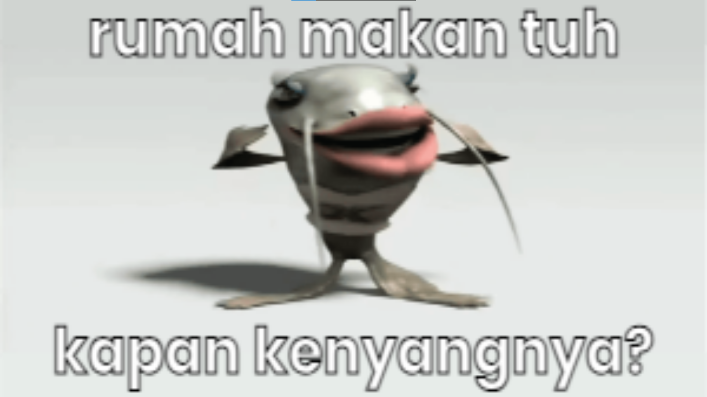

*sebuah reaction image yang menyertakan gambar seekor ikan lele yang sedang bergoyang dan diberi caption pertanyaan  yang menyanyakan  kalimat yang terasa absurd jika diartikan per kata. - [Know Your Meme Indonesia - Unofficial (Via Facebook)](https://web.facebook.com/knowyourmemeID/posts/pfbid088cP1qTte5pK4G8oDRt5zRmpaqzrZoH8y5GN8NZYd4it9XPEwpF1D1ZNiU2S63yQl).*

Projek ini akan memberikan beberapa text random yang ada di file [data.js](https://github.com/JastinXyz/ikan-lele-bertanya/blob/main/data.js). Sangat welcome jika ingin menambah beberapa text baru dengan cara fork repo ini dan buka pull request baru 👌.

## Demo

https://jastinxyz.github.io/ikan-lele-bertanya

## Try it yourself

- Clone this repo
- Open the index.html
- Enjoy

